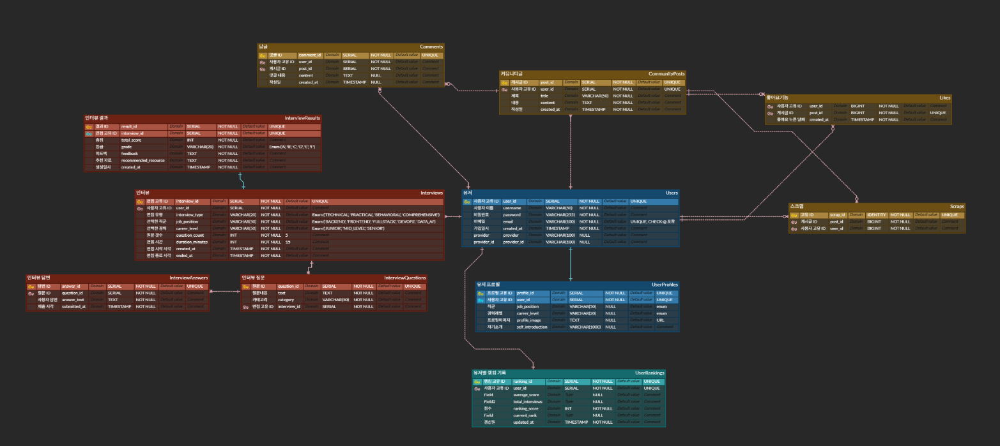

<div align="center">
    
<h2>AI 기반 개발자 모의 면접 시뮬레이터 DevView</h2>
</div>

<div align="center">

[](https://spring.io/projects/spring-boot)
[](https://www.oracle.com/java/)
[](https://www.postgresql.org/)
[](https://www.thymeleaf.org/)

**개발자를 위한 AI 기반 모의 면접 플랫폼**

</div>

## 📚 목차
1. [프로젝트 개요 & 차별성](#1-프로젝트-개요--차별성)
2. [팀원 소개 & 역할 분담](#2-팀원-소개--역할-분담)
3. [ERD & 데이터베이스 구조](#3-erd--데이터베이스-구조)
4. [주요 기능 소개](#4-주요-기능-소개)
5. [디렉토리 구조](#5-디렉토리-구조)
6. [브랜치 전략 & 컨벤션](#6-브랜치-전략--컨벤션)
7. [트러블슈팅 사례 (Troubleshooting)](#7-트러블슈팅-사례-troubleshooting)
8. [기술 스택 (Tech Stack)](#8-기술-스택-tech-stack)
9. [팀원별 프로젝트 후기 (Retrospective)](#9-팀원별-프로젝트-후기-retrospective)

---

# 1. 프로젝트 개요 & 차별성

## 🎯 프로젝트 개요

**DevView**는 신입 개발자 취업 준비생을 위한 **AI 면접 시뮬레이터 플랫폼**입니다.
취업 시장에서는 단순한 코딩 실력뿐만 아니라 **논리적 사고·문제 해결 능력·커뮤니케이션 스킬**까지 종합적으로 평가합니다. 그러나 대부분의 취준생은 실제 면접 경험이 부족하고, 피드백을 받을 기회가 제한적입니다.

이러한 문제를 해결하기 위해, DevView는 **AI 기반의 모의 면접 기능**을 제공하여 사용자가 실전과 유사한 환경에서 면접을 연습하고, **즉각적인 피드백**을 받을 수 있도록 설계되었습니다.

📅 **진행 기간** : 2025.07.29 \~ 2025.08.25 (총 4주)

🅰️ **팀명** : 올인원 (All-in-One)
📤 **배포** : [📤 서비스 배포 링크](https://devview.kro.kr/)
🅿️ **발표자료** : [📑 발표 자료 보기 (Google Slides)](https://docs.google.com/presentation/d/16nU0tfxW_LWEZtgjntebanmCDljiWTkw/edit?usp=sharing&ouid=116558675202954145579&rtpof=true&sd=true)

👨‍💻 **역할 방식** : 프론트엔드·백엔드 영역 구분 없이 **풀스택 협업**, 필요 시 유연 분담

## 🚀 프로젝트 차별성

DevView는 단순한 연습 도구를 넘어, **학습·분석·경험 공유까지 연결되는 플랫폼**을 목표로 합니다.

1. **실시간 AI 피드백**

* 답변에 대한 **점수**, **강점·개선점**, **예시 답변**을 즉시 제공
* 피드백은 AI 모델(Gemini & 앨런 AI)을 통해 자동 생성되어, 반복 학습 효과 극대화
2. **맞춤 질문 생성**

* 사용자의 **자기소개서·희망 직무·기술 스택**을 분석
* 개인별 취약 영역을 공략하는 **맞춤형 질문** 제공
3. **리포트 아카이빙**

* 면접 기록을 **결과 리포트**로 확인
* 이전 기록과 점수를 비교하여 성장 곡선 확인, 포트폴리오 활용 가능
4. **커뮤니티 & 랭킹 시스템**

* 면접 경험 후기 공유, 점수 기반 랭킹으로 동기부여
* Top 3 시상대 시각화로 성취감 강화

## 📌 기대 효과

* 취업 준비생 : **실전 면접 감각** 향상 & **객관적 피드백** 확보
* 교육 기관 : 학생들의 **학습 추세 데이터** 확보 & 관리
* 기업 : 지원자의 **기술·커뮤니케이션 능력 검증 도구**로 활용

---

# 2. 팀원 소개 & 역할 분담

## 🔹 팀 구성

본 프로젝트는 **올인원(All-in-One)** 팀이 진행했으며, 팀원 모두가 프론트엔드와 백엔드를 가리지 않고 **풀스택 개발**을 경험했습니다. 효율적 진행을 위해 **주요 담당 도메인**을 분배했습니다.

## 🧑‍💻 팀원 소개
|  |  |  |  |
| :-------------------------------------------------------------: | :------------------------------------------------------------: |:---------------------------------------------------------------:| :---------------------------------------------------------------------------------------: |
| [**김진욱 (팀장)**](https://github.com/Jaykim98z) | [**이소연**](https://github.com/BlueGiraffe07) |             [**김예은**](https://github.com/yeeunkim7)             | [**조권호**](https://github.com/sswck) |

---


## 📆 역할 분담
| **김진욱 (팀장)** | **이소연** | **김예은** | **조권호** |
|------------------|------------|------------|------------|
| 인증·보안·배포   | 메인/마이페이지·문서화 | 커뮤니티·DB | 면접 세션·AI 연동 |
| 로그인/회원가입 API,<br>Google OAuth2 및,<br>Spring Security 적용,<br>랭킹 페이지 구현과,<br>AWS EC2 배포와,<br>시연 영상 제작 | 메인 & 마이페이지 UI,<br>Header/Footer 제작,<br>공통 컴포넌트 구성,<br>프로젝트 README 관리,<br>Notion 문서 관리,<br>발표 자료 준비 | 게시글/댓글/좋아요,<br>스크랩 CRUD 구현,<br>ERD 구조 설계와,<br>마이그레이션 작업,<br>최종 발표 준비와,<br>최종 발표 진행 | 앨런 AI와 Gemini,<br>질문 생성과 피드백,<br>결과 리포트 작성,<br>Swagger 문서화,<br>발표 자료 준비,<br>시연 발표 지원 |

## ⚖️ 협업 방식

* **WBS** 기반 기간별 마일스톤 수립 & 점검
* **Notion**으로 문서화/진행 현황 관리, **Discord**로 실시간 소통
* **코드 리뷰**와 **브랜치 전략**으로 품질·생산성 향상

---

# 3. ERD & 데이터베이스 구조

## 📌 설계 개요

DevView는 **사용자 중심 데이터 흐름**과 **면접 세션·피드백 데이터 관리**에 초점을 두어 DB를 설계했습니다.

1. **확장성** — 커뮤니티·랭킹·AI 피드백 등 기능 추가 시 유연 확장
2. **무결성** — 면접 기록/사용자/피드백 간 관계 일관성 유지
3. **효율성** — 대량 질문/답변의 빠른 조회

## 🗺️ ERD 다이어그램

<p align="center">
  
</p>

## 🏗️ 주요 테이블 구조

<details>
<summary>👤 Users (회원 정보)</summary>

* 회원 기본 정보 및 OAuth2 계정 연동
* 커뮤니티·랭킹·프로필과 연계

| 컬럼명          | 타입        | 설명                   |
| ------------ | --------- | -------------------- |
| user\_id     | SERIAL PK | 고유 회원 ID             |
| username     | VARCHAR   | 사용자 이름(Unique)       |
| email        | VARCHAR   | 이메일(Unique)          |
| password     | VARCHAR   | 암호화 비밀번호             |
| created\_at  | TIMESTAMP | 가입일                  |
| provider     | VARCHAR   | OAuth2 제공자(Google 등) |
| provider\_id | VARCHAR   | OAuth2 제공자 식별자       |

</details>

<details>
<summary>💬 Interviews (면접 세션)</summary>

| 컬럼명               | 타입        | 설명                                              |
| ----------------- | --------- | ----------------------------------------------- |
| interview\_id     | SERIAL PK | 세션 ID                                           |
| user\_id          | SERIAL FK | Users 참조                                        |
| interview\_type   | ENUM      | TECHNICAL, PRACTICAL, BEHAVIORAL, COMPREHENSIVE |
| job\_position     | VARCHAR   | 직무(백엔드/프론트엔드 등)                                 |
| career\_level     | ENUM      | JUNIOR, MID, SENIOR                             |
| question\_count   | INT       | 질문 개수                                           |
| duration\_minutes | INT       | 소요 시간(분)                                        |
| created\_at       | TIMESTAMP | 시작 시각                                           |
| ended\_at         | TIMESTAMP | 종료 시각                                           |

</details>

<details>
<summary>📝 InterviewQuestions (면접 질문)</summary>

| 컬럼명           | 타입        | 설명            |
| ------------- | --------- | ------------- |
| question\_id  | SERIAL PK | 질문 ID         |
| text          | TEXT      | 질문 본문         |
| category      | VARCHAR   | 질문 카테고리       |
| interview\_id | SERIAL FK | Interviews 참조 |

</details>

<details>
<summary>🗨️ InterviewAnswers (면접 답변)</summary>

| 컬럼명           | 타입        | 설명                    |
| ------------- | --------- | --------------------- |
| answer\_id    | SERIAL PK | 답변 ID                 |
| question\_id  | SERIAL FK | InterviewQuestions 참조 |
| answer\_text  | TEXT      | 사용자 답변                |
| submitted\_at | TIMESTAMP | 제출 시각                 |

</details>

<details>
<summary>📊 InterviewResults (면접 결과/피드백)</summary>

| 컬럼명                   | 타입        | 설명             |
| --------------------- | --------- | -------------- |
| result\_id            | SERIAL PK | 결과 ID          |
| interview\_id         | SERIAL FK | Interviews 참조  |
| total\_score          | INT       | 총점             |
| grade                 | VARCHAR   | 등급(A+, A, B 등) |
| feedback              | TEXT      | 피드백            |
| recommended\_resource | TEXT      | 추천 학습 리소스      |
| created\_at           | TIMESTAMP | 생성일            |

</details>

<details>
<summary>🧑‍💻 UserProfiles (회원 프로필)</summary>

| 컬럼명                | 타입        | 설명                |
| ------------------ | --------- | ----------------- |
| profile\_id        | SERIAL PK | 프로필 ID            |
| user\_id           | SERIAL FK | Users 참조          |
| job\_position      | VARCHAR   | 직무                |
| career\_level      | ENUM      | JUNIOR/MID/SENIOR |
| profile\_image     | URL       | 프로필 이미지           |
| self\_introduction | TEXT      | 자기소개              |

</details>

<details>
<summary>🏆 UserRankings (회원 랭킹)</summary>

| 컬럼명               | 타입        | 설명       |
| ----------------- | --------- | -------- |
| ranking\_id       | SERIAL PK | 랭킹 ID    |
| user\_id          | SERIAL FK | Users 참조 |
| average\_score    | FLOAT     | 평균 점수    |
| total\_interviews | INT       | 총 인터뷰 횟수 |
| current\_rank     | INT       | 현재 순위    |
| created\_at       | TIMESTAMP | 생성일      |
| updated\_at       | TIMESTAMP | 수정일      |

</details>

<details>
<summary>📌 CommunityPosts (커뮤니티 게시글)</summary>

| 컬럼명         | 타입        | 설명     |
| ----------- | --------- | ------ |
| post\_id    | SERIAL PK | 게시글 ID |
| user\_id    | SERIAL FK | 작성자    |
| title       | VARCHAR   | 제목     |
| content     | TEXT      | 본문     |
| created\_at | TIMESTAMP | 작성일    |

</details>

<details>
<summary>💬 Comments (댓글)</summary>

| 컬럼명         | 타입        | 설명     |
| ----------- | --------- | ------ |
| comment\_id | SERIAL PK | 댓글 ID  |
| user\_id    | SERIAL FK | 작성자    |
| post\_id    | SERIAL FK | 게시글 참조 |
| content     | TEXT      | 댓글 본문  |
| created\_at | TIMESTAMP | 작성일    |

</details>

<details>
<summary>❤️ Likes (좋아요)</summary>

| 컬럼명                  | 타입        | 설명                |
| -------------------- | --------- | ----------------- |
| user\_id             | BIGINT FK | Users 참조          |
| post\_id             | BIGINT FK | CommunityPosts 참조 |
| created\_at          | TIMESTAMP | 생성일               |
| (user\_id, post\_id) | UNIQUE    | 중복 방지             |

</details>

<details>
<summary>📌 Scraps (스크랩)</summary>

| 컬럼명       | 타입        | 설명       |
| --------- | --------- | -------- |
| scrap\_id | SERIAL PK | 스크랩 ID   |
| post\_id  | BIGINT FK | 게시글 참조   |
| user\_id  | BIGINT FK | Users 참조 |

</details>

## ✅ 설계 포인트

1. **User 중심**으로 모든 엔티티 연결 → 확장성 확보
2. **면접 데이터 → 피드백 → 리포트** 흐름 자연스러운 연계
3. **커뮤니티·랭킹**은 동기부여 요소로 독립적이면서 User와 관계 유지
4. **Flyway** 기반 마이그레이션으로 이력 추적 및 협업 용이

---

# 4. 주요 기능 소개

➡️ [상세 ERD/테이블 구조 보러가기 (Notion)](https://www.notion.so/25780666e06880e7b2cec00b635cc279?source=copy_link)

### <summary>1️⃣ 로그인 & 회원가입</summary>
<p align="center">
  
</p>

* **기본 로그인/회원가입**
    * 이메일 + 비밀번호 등록(BCrypt 암호화)
    * CSRF, 세션 보안 적용

* **소셜 로그인**
<p align="center">
  
</p>

* Google OAuth2 지원, 최초 로그인 시 provider 저장

* **에러 처리**
    * 중복 이메일 가입 예외, 인증 실패 시 CustomException 적용

---

### <summary>2️⃣ 메인 페이지</summary>
<p align="center">

</p>

* **Hero 배너** — 플랫폼 핵심 가치 강조(모의면접)
* **서비스 소개 섹션** — 면접 세션, 피드백, 랭킹, 커뮤니티
* **후기 섹션** — 커뮤니티 게시글 일부 노출

---

### <summary>3️⃣ 면접 세션</summary>
<p align="center">
  
</p>

* **질문 생성** — Gemini API 기반 직무 맞춤형 질문
* **답변 입력** — 텍스트 입력(추후 음성 확장 가능)
* **실시간 피드백** — 앨런 AI API 활용(점수/강점/개선점/예시)

---

### <summary>4️⃣ 마이페이지</summary>
<p align="center">
  
</p>

* **프로필 관리** — 이름, 직무, 프로필 이미지
* **면접 기록 조회** — 점수·피드백 이력
* **시각화 차트** — 점수 변화 라인 차트
* **내 활동** — 작성 글·댓글 모아보기

---

### <summary>5️⃣ 커뮤니티</summary>
<p align="center">
  
</p>

* 후기 작성/수정/삭제, 댓글·좋아요·스크랩
* 직무/키워드 검색, 페이징

---

### <summary>6️⃣ 랭킹</summary>
<p align="center">
  
</p>

* **Top 3 시상대 UI**
* **Top 20 테이블** — 닉네임/평균 점수/순위
* **내 순위 강조** — 로그인 사용자 하이라이트

---

### <summary>7️⃣ 결과 리포트</summary>
<p align="center">
  
</p>

* **구성** — 질문·답변, AI 피드백(점수/강점/개선점), 예시 답변, 전체 평균 점수

---

# 5. 디렉토리 구조

**Spring Boot 백엔드 + Thymeleaf 프론트엔드 + AWS 배포** 구조입니다.

```bash
DevView/
├── src/
│   ├── main/
│   │   ├── java/com/allinone/devview/
│   │   │   ├── common/
│   │   │   ├── community/
│   │   │   ├── feedback/
│   │   │   ├── interview/
│   │   │   ├── mypage/
│   │   │   ├── ranking/
│   │   │   ├── security/
│   │   │   ├── user/
│   │   │   └── DevViewApplication.java
│   │   └── resources/
│   │       ├── static/
│   │       │   ├── css/
│   │       │   ├── js/
│   │       │   └── img/
│   │       ├── templates/
│   │       ├── db/migration/
│   │       └── application.yml
│   └── test/
├── pom.xml
└── README.md
```

## 📂 주요 디렉토리 설명

* **common/** — GlobalExceptionHandler, ResponseDto, CustomErrorCode
* **community/** — 게시판·댓글·좋아요·스크랩 CRUD, API/Controller/Repository
* **feedback/** — 면접 피드백 로직, 외부 AI 응답 처리
* **interview/** — 질문 생성·답변 피드백, 엔티티(질문/답변/점수)
* **mypage/** — 프로필 관리, 기록 조회, 차트
* **ranking/** — Top20 정렬, 점수 업데이트 이벤트
* **security/** — Spring Security & OAuth2, BCryptPasswordEncoder, CustomUserDetailsService
* **user/** — 회원가입/로그인, OAuth2 사용자 저장

## 📦 배포 관련 파일

* **application.yml** — 환경변수 분리(dev/prod 프로필)
* **Nginx 설정** — EC2 Reverse Proxy

---

# 6. 브랜치 전략 & 컨벤션

## 🔹 브랜치 전략 (Branch Strategy)
**협업 흐름** : 
`feature/*` → **PR** → 코드 리뷰(1인 이상) → **develop** 통합·검증 → **main** 머지(배포)

* **main** : 배포 가능한 안정 브랜치(보호 브랜치)
* **develop** : **배포 전 통합 테스트** 및 기능 통합 검증 브랜치
* **feature/**\* : 기능 단위 작업 브랜치 <br>(예: `feature/login-jinwook`, `feature/mypage-blue`,`feature/interview-sswck`,`feature/community-yeeun` )

## 📌 컨벤션(Convention)

**컨벤션이란?** <br>팀원이 함께 정한 공통의 약속/규칙입니다. 코드 스타일, 파일명, 커밋 메시지, 브랜치·PR 운영까지 동일한 기준을 사용해 **협업 효율**과 **품질**을 높입니다.
* 효과: 협업 효율 ↑ / 코드 일관성 ↑ / 버그 감소 / 유지보수성 향상

### 📁 파일·폴더 및 네이밍

* **패키지명** : 소문자, 언더스코어 금지, 리버스 도메인(`com.company.project`)
* **클래스명** : PascalCase, 명사 중심, 의미 명확
* **메서드명** : camelCase, 동사 시작, 의도 드러나게
* **변수명** : camelCase, 명사 중심, 불필요한 축약 지양
* **상수명** : `UPPER_SNAKE_CASE`, `staticfinal`
* **의존 라이브러리 사용**
    * Lombok : 합의된 애너테이션만(@Getter, @Builder 등), 엔티티 과도 사용 지양
### 🧼 코드 스타일

* 들여쓰기 **스페이스 4칸**(탭 금지)
* 한 줄 **최대 120자** 권장
* 메서드 **약 20줄 이내**로 분리(검증/매핑/로직)
* **K\&R** 중괄호 스타일
* 문장 종료 시 **세미콜론 필수**
* 추가 권장: 불필요한 import 제거, `Objects.requireNonNull`/`Optional` 적절 활용,
  레이어 분리(Controller/Service/Repository), 전역 예외 처리기 통한 응답 포맷 일관

### 🔀 Merge & PR (PR로만 머지)

* 머지 방식: **Pull Request 전용**
* 흐름: `feature/*` → PR → 리뷰 승인(1+명) → **develop** 머지(통합 테스트) → **main** 머지(배포)
* **CI 통과 필수**, **main 보호 브랜치** 권장(직접 푸시 금지)
* 머지 방식: **Squash Merge 권장**(히스토리 단순화)

**PR 제목 템플릿**<br>
`[FEAT] 로그인 API 추가` / `[FIX] 회원가입 검증 로직 수정` / `[DOCS] README 배포 가이드 업데이트`

**PR 본문(필수)**

* 작업 요약 / 변경 사항
* 스크린샷(해당 시)
* 테스트/검증 내용
* 이슈 번호(해당 시)

**브랜치 네이밍**

* `feature/<영역>-<설명>` 예) `feature/auth-login`
* `fix/<이슈번호>-<설명>` 예) `fix/123-email-dup-check`
* `docs/<문서주제>` 예) `docs/readme-deploy`

### 💬 커밋 메시지 (Conventional Commits)

**형식** `type(scope): subject`
예) `feat(auth): google oauth2 로그인 추가`

**type 목록(소문자 권장)**
`feat`, `fix`, `docs`, `style`, `refactor`, `test`, `chore`, `perf`, `build`, `ci`, `revert`
*(Design/Remove/Rename/Fixing 등은 style/refactor/chore/test 등으로 매핑 권장)*

**예시**

```
git commit -m "feat(interview): 질문 생성 로직에 난이도 옵션 추가"
git commit -m "fix(user): 이메일 중복 검사 예외 처리"
git commit -m "docs(readme): 배포 가이드 업데이트"
```

**멀티라인 예시**

```
git commit -m "refactor(ranking): 조회 쿼리 최적화" \
            -m "상세: join 범위를 축소하고 인덱스 힌트를 적용했습니다."
```

### 😒 이슈 템플릿(가이드)

**제목**
`[Feature] 랭킹 Top20 조회 API 구현` / `[Bug] 회원가입 검증 실패 시 500 응답`

**본문**

* ✅ 개요(무엇을, 왜)
* 🛠 작업 내용

    * [ ] 항목1
    * [ ] 항목2
* 📎 참고(스크린샷/로그/링크)

**Tag/Label 권장**
`feature`, `bug`, `refactor`, `docs`, `style`, `question`, `chore`, `perf`, `build`, `ci`

---
# 7. 트러블슈팅 사례 (Troubleshooting)

### ① Database — Flyway 마이그레이션 충돌

* **문제**: Flyway 스크립트 실행 중 버전 충돌 및 에러 발생
* **원인**: 팀원 간 마이그레이션 파일 버전 중복
* **해결**: 마이그레이션 파일 작성 규칙 수립, 버전 관리 철저
* **교훈**: DB 변경사항은 사전에 공유하고, 공통 규칙 및 프로세스를 준수로 안정적인 협업 가능

---

### ② Github — 브랜치 충돌 문제

* **문제**: 브랜치 병합 과정에서 대규모 머지 충돌 발생
* **원인**: 브랜치 병합 주기 불규칙, 변경사항 공유 부족
* **해결**: 병합 전 코멘트 또는 디스코드에 변경사항 공지, 주기적 머지 습관화
* **교훈**: 충돌 방지를 위해 **짧은 주기 머지 + 사전 공유**가 필수

---

### ③ Login API — 500 오류 발생

* **문제**: 로그인 API 요청 시 500 에러 발생
* **원인**: User 직렬화 설정 충돌, DTO와 Entity 구분 미흡
* **해결**: `UserDetails` 구현체를 DTO로 분리, OpenAPI(Swagger) 기반 관리로 일관성 확보
* **교훈**: 인증 객체는 가볍게 유지하고, DTO/Entity 분리로 안정성 확보

---

### ④ AI API — 응답 지연 문제

* **문제**: 질문 생성 및 피드백 요청 시 응답 지연(7~10초 이상)
* **원인**: 동기 처리, UI 로딩 상태 미구현
* **해결**: 비동기 처리 적용, 로딩 스피너 추가, 캐싱 도입
* **교훈**: 외부 API 호출은 **비동기 + 캐싱**을 적용하고, UX 개선 요소 반영 중요

---

## 8. 기술 스택 (Tech Stack)

### 📌 프론트엔드

* HTML5, SCSS, JavaScript
* Thymeleaf
* Chart.js, Axios
* 반응형 UI, SSR 기반 SEO 대응

### 📌 백엔드

* Java 17, Spring Boot
* Spring Security, OAuth2, Spring Data JPA, Validation
* Flyway

### 📌 데이터베이스

* **PostgreSQL**
* 정규화/관계 최적화, 도메인 중심 설계
* **Flyway 마이그레이션**, Redis 캐시(세션/반복 질의 캐싱)

### 📌 인프라 & 배포

* AWS EC2, S3, Nginx
* GitHub Actions → EC2 배포 자동화

### 📌 AI 서비스

* Gemini API, 앨런 AI API
* 비동기 호출, 로깅 & 캐싱

### 📌 협업 툴

* GitHub, Notion, Discord, Google Docs/Slides, Figma

### 📌 설계/문서화 툴

* ERDCloud, Swagger
<details>
<summary>📖 Swagger (API 문서 예시)</summary>
<p align="center">
  

</p>
</details>

---
## 9. 팀원별 프로젝트 후기 (Retrospective)

### 👨‍💻 김진욱 (팀장 / 인증·랭킹·배포 담당)

* 처음에는 단순한 로그인 기능부터 시작했지만, OAuth2와 보안, 사용자 개인화까지 아우르는 종합적인 사용자 경험을 설계하면서 많이 성장할수있었던것 같습니다. 특히 자기소개 기반 AI 면접 개인화와 실시간 랭킹 시스템을 통해 단순한 CRUD를 넘어 실제 서비스 수준의 복잡한 비즈니스 로직을 구현할 수 있어 뿌듯했습니다.


> “운영까지 고려한 개발 경험을 할 수 있어서 큰 자신감을 얻었습니다.”

### 👩‍💻 이소연 (마이페이지·메인페이지·문서화 담당)

* 메인 페이지와 마이페이지 UI, 그리고 Header/Footer 공통 컴포넌트를 제작하면서 서비스 전반의 UI·UX 일관성이 얼마나 중요한지 깊이 느낄 수 있었습니다. 또한 README와 Notion 등 협업 문서화를 맡으며, 기록이 단순한 정리를 넘어 팀의 생산성과 효율성을 높이는 중요한 자산이 된다는 사실을 배웠습니다.


> “협업 문서화를 통해 팀 전체의 생산성을 높일 수 있음을 깨달았습니다.”

### 👩‍💻 김예은 (커뮤니티 담당)

* 커뮤니티 페이지를 만들면서 단순히 글만 보여주는게 아니라 좋아요, 댓글 같은 상호작용까지 붙으니까 진짜 서비스같은 느낌이 들어서 재밌었습니다.


> “백엔드 CRUD 구현을 완벽히 경험하며 자신감을 얻었고, 발표 능력도 함께 성장했습니다.”

### 👨‍💻 조권호 (면접 세션·AI 담당)

* 개발 처음에는 간단한 Ai 프롬프트 작성부터 시작했지만, 진행하면서 실제 서비스 수준의 고민을 담아내는 좋은 경험이 된 것 같습니다. 그리고 이전 프로젝트의 경험과 피드백들이 많은 도움이 된 것 같습니다. 다른 팀원분들 없이 혼자 모든 프로젝트를 진행했다면 아직까지도 끙끙대며 설계했을 것 같아 다시한번 협업의 중요성을 깨달았습니다.


> “AI와 백엔드, 사용자 경험까지 연결하는 흐름을 직접 설계한 경험이 가장 값졌습니다.”

---

<div align="center">
  <strong>🎯 DevView와 함께 면접 준비의 새로운 기준을 만들어가요!</strong>
</div>

---
